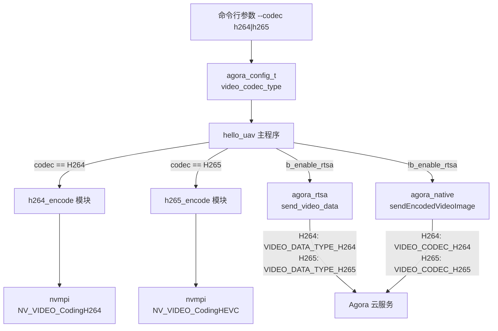
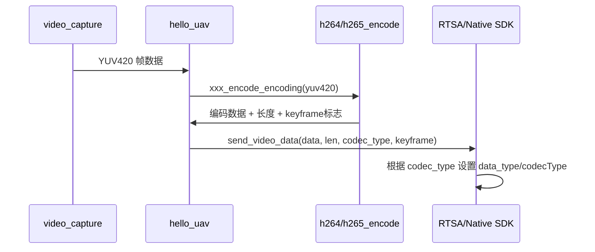

# H265 编码器功能 - 技术设计文档

## 概述

本设计基于现有 H264 编码器实现，新增 H265 (HEVC) 编码器模块。核心思路是复用 nvmpi 硬件编码接口（已支持 `NV_VIDEO_CodingHEVC`），以与 H264 编码器完全一致的接口模式实现 H265 编码器，并在主程序、配置结构体、命令行解析、RTSA/Native SDK 发送层进行适配，使系统能够根据用户配置在 H264 和 H265 之间无缝切换。

### 设计原则

- **最小改动原则**：H265 编码器模块直接复制 H264 编码器的全局静态变量模式，仅修改编码类型为 `NV_VIDEO_CodingHEVC`
- **接口一致性**：H265 编码器对外暴露与 H264 完全相同的函数签名模式（init/encoding/fini/generate_key_frame/set_target_bps）
- **向后兼容**：默认编码器类型为 H264，不影响现有功能

## 架构

### 系统架构图



### 数据流



## 组件与接口

### 1. H265 编码器模块 (`src/core/h265_encode.h` / `h265_encode.c`)

与 H264 编码器接口完全对称，使用全局静态变量模式：

```c
// h265_encode.h
int h265_encode_init(uint32_t width, uint32_t height, uint32_t fps, uint32_t bps);
void h265_encode_fini(void);
int h265_encode_encoding(uint8_t *yuv420, uint8_t **h265, bool *is_key_frame);
int h265_encode_generate_key_frame(void);
int h265_encode_set_target_bps(int bps);
```

实现要点：
- 内部调用 `nvmpi_create_encoder(NV_VIDEO_CodingHEVC, &param)` 创建编码器
- H265 profile 设置为 Main (1)，level 设置为 Main Tier Level 5.0 (150)
- 其余逻辑（帧输入、包获取、缓冲区管理、码率调整、关键帧生成）与 H264 编码器完全一致

### 2. 视频编码类型枚举与配置扩展 (`inc/agora_config.h`)

```c
// New enum
typedef enum {
  VIDEO_CODEC_TYPE_H264 = 0,
  VIDEO_CODEC_TYPE_H265 = 1,
} video_codec_type_e;

// Extended struct field
typedef struct {
  // ... existing fields ...
  video_codec_type_e video_codec_type;  // default: VIDEO_CODEC_TYPE_H264
} agora_config_t;
```

### 3. 命令行参数扩展 (`src/hello_uav.c`)

新增 `-C` / `--codec` 选项：

```c
// short_option 新增 'C:'
// long_option 新增 { "codec", 1, NULL, 'C' }
// case 'C': 解析 "h264" 或 "h265" 设置 video_codec_type
```

### 4. 主程序编码器动态选择 (`src/hello_uav.c`)

根据 `g_config.video_codec_type` 在以下位置进行分支：
- `__sdk_target_bitrate_change`: 调用对应编码器的 `set_target_bps`
- `__sdk_key_frame_request`: 调用对应编码器的 `generate_key_frame`
- `__worker`: 调用对应编码器的 `init`、`encoding`、`fini`

### 5. RTSA SDK 发送接口适配 (`src/rtsa/agora_rtsa.c`, `inc/agora_rtsa_sdk.h`)

新增通用发送函数：

```c
// agora_rtsa_sdk.h - new function
int agora_rtsa_send_video_data(uint8_t *data, size_t len, video_codec_type_e codec_type);
```

实现中根据 `codec_type` 设置 `video_frame_info_t.data_type`：
- `VIDEO_CODEC_TYPE_H264` → `VIDEO_DATA_TYPE_H264`
- `VIDEO_CODEC_TYPE_H265` → `VIDEO_DATA_TYPE_H265`

移除原有 `agora_rtsa_send_h264_data`，统一使用 `agora_rtsa_send_video_data`。

### 6. Native SDK 发送接口适配 (`src/native/sample_send_h264_pcm.cpp`, `inc/agora_native_sdk.h`)

新增通用发送函数：

```c
// agora_native_sdk.h - new function
int agora_native_send_video_data(uint8_t *data, size_t len, bool isKeyFrame, video_codec_type_e codec_type);
```

实现中根据 `codec_type` 设置 `EncodedVideoFrameInfo.codecType`：
- `VIDEO_CODEC_TYPE_H264` → `agora::rtc::VIDEO_CODEC_H264`
- `VIDEO_CODEC_TYPE_H265` → `agora::rtc::VIDEO_CODEC_H265`

移除原有 `agora_native_send_h264_data`，统一使用 `agora_native_send_video_data`。

### 7. 主程序发送层适配 (`src/hello_uav.c`)

修改 `__agora_rtc_send_h264` 为 `__agora_rtc_send_video`，传入 `codec_type`：

```c
static void __agora_rtc_send_video(uint8_t *data, size_t len, bool keyframe)
{
  if (g_config.b_enable_rtsa) {
    agora_rtsa_send_video_data(data, len, g_config.video_codec_type);
  } else {
    agora_native_send_video_data(data, len, keyframe, g_config.video_codec_type);
  }
}
```

### 8. 构建系统更新 (`CMakeLists.txt`)

在 `SOURCES` 列表中添加 `src/core/h265_encode.c`。

## 数据模型

### 编码类型枚举

| 枚举值 | 数值 | 说明 |
|--------|------|------|
| `VIDEO_CODEC_TYPE_H264` | 0 | H264 编码（默认） |
| `VIDEO_CODEC_TYPE_H265` | 1 | H265/HEVC 编码 |

### agora_config_t 扩展字段

| 字段 | 类型 | 默认值 | 说明 |
|------|------|--------|------|
| `video_codec_type` | `video_codec_type_e` | `VIDEO_CODEC_TYPE_H264` | 视频编码类型 |

### 编码类型到 SDK 数据类型映射

| video_codec_type | RTSA data_type | Native codecType |
|-----------------|----------------|------------------|
| `VIDEO_CODEC_TYPE_H264` | `VIDEO_DATA_TYPE_H264` (2) | `VIDEO_CODEC_H264` |
| `VIDEO_CODEC_TYPE_H265` | `VIDEO_DATA_TYPE_H265` (3) | `VIDEO_CODEC_H265` |

### H265 编码器参数配置

| 参数 | 值 | 说明 |
|------|-----|------|
| `codingType` | `NV_VIDEO_CodingHEVC` | HEVC 编码类型 |
| `profile` | 1 (Main) | H265 Main Profile |
| `level` | 150 (Level 5.0) | 支持 4K@30fps |
| `insert_spspps_idr` | 1 | 在 IDR 帧前插入 VPS/SPS/PPS |
| `iframe_interval` | fps * 2 | 关键帧间隔（与 H264 一致） |

## 正确性属性 (Correctness Properties)

*属性是指在系统所有有效执行中都应保持为真的特征或行为——本质上是关于系统应该做什么的形式化陈述。属性是人类可读规范与机器可验证正确性保证之间的桥梁。*

### Property 1: H265 编码器初始化对有效参数应成功

*For any* 有效的 width（>0）、height（>0）、fps（>0）、bps（>0）参数组合，调用 `h265_encode_init` 应返回 0（成功），且后续调用 `h265_encode_fini` 不应崩溃。

**Validates: Requirements 1.3**

### Property 2: H265 编码器对有效 YUV420 输入应产生非空输出

*For any* 有效的 YUV420 帧数据（尺寸与初始化时的 width*height 匹配），调用 `h265_encode_encoding` 应返回正数长度，且输出指针非空。

**Validates: Requirements 1.4**

### Property 3: H265 编码器码率调整对有效值应成功

*For any* 正整数码率值 bps，在编码器已初始化的状态下调用 `h265_encode_set_target_bps(bps)` 应返回 0（成功）。

**Validates: Requirements 1.7**

### Property 4: SDK 回调根据编码类型正确路由到对应编码器

*For any* `video_codec_type_e` 值（H264 或 H265），当 SDK 触发码率调整或关键帧请求回调时，主程序应调用与当前 `video_codec_type` 对应的编码器的 `set_target_bps` 或 `generate_key_frame` 函数。

**Validates: Requirements 4.3, 4.4**

### Property 5: RTSA 发送器正确映射编码类型到视频数据类型

*For any* `video_codec_type_e` 值，RTSA 发送函数应将其映射为正确的 `video_data_type_e`：`VIDEO_CODEC_TYPE_H264` → `VIDEO_DATA_TYPE_H264`，`VIDEO_CODEC_TYPE_H265` → `VIDEO_DATA_TYPE_H265`。

**Validates: Requirements 5.2, 5.3**

### Property 6: Native 发送器正确映射编码类型到视频编解码类型

*For any* `video_codec_type_e` 值，Native 发送函数应将其映射为正确的 `agora::rtc::VIDEO_CODEC_TYPE`：`VIDEO_CODEC_TYPE_H264` → `VIDEO_CODEC_H264`，`VIDEO_CODEC_TYPE_H265` → `VIDEO_CODEC_H265`。

**Validates: Requirements 6.2, 6.3**

## 错误处理

### 编码器初始化失败

- `nvmpi_create_encoder` 返回 NULL 时，`h265_encode_init` 返回 -1，不分配缓冲区
- 日志记录错误信息，上层调用者应检查返回值并终止流程

### 编码器未初始化时的调用保护

- `h265_encode_encoding`、`h265_encode_generate_key_frame`、`h265_encode_set_target_bps` 在 `g_ctx == NULL` 时返回 -1
- 与 H264 编码器保持一致的错误处理模式

### 编码缓冲区溢出

- 编码输出缓冲区初始大小 128KB，当数据超出时通过 `realloc` 动态扩展（与 H264 一致）

### SDK 发送失败

- RTSA/Native 发送函数返回错误时，由上层日志记录，不中断编码流程
- 与现有 H264 发送的错误处理策略一致

### 无效命令行参数

- 当 `--codec` 参数值既不是 "h264" 也不是 "h265" 时，保持默认值 H264 并输出警告日志

## 错误处理

### 编码器初始化失败

- `h265_encode_init` 中 `nvmpi_create_encoder` 返回 NULL 时，函数返回 -1，不分配缓冲区内存
- 与 H264 编码器行为一致（参考 `h264_encode.c` 第 33-36 行）

### 编码器未初始化时的操作

- `h265_encode_encoding`：内部 `g_ctx` 为 NULL 时，`nvmpi_encoder_put_frame` 会失败，函数返回 -1
- `h265_encode_generate_key_frame`：检查 `g_ctx` 是否为 NULL，为 NULL 时返回 -1
- `h265_encode_set_target_bps`：检查 `g_ctx` 是否为 NULL，为 NULL 时返回 -1

### 缓冲区动态扩展

- 编码输出超过当前缓冲区大小时，使用 `realloc` 扩展为 2 倍（与 H264 一致）

### 无效命令行参数

- `-C` 参数值既非 "h264" 也非 "h265" 时，保持默认值 `VIDEO_CODEC_TYPE_H264`，不报错

### SDK 发送失败

- `agora_rtsa_send_video_data` 和 `agora_native_send_video_data` 的错误处理与现有 H264 发送函数一致，返回底层 SDK 的错误码
